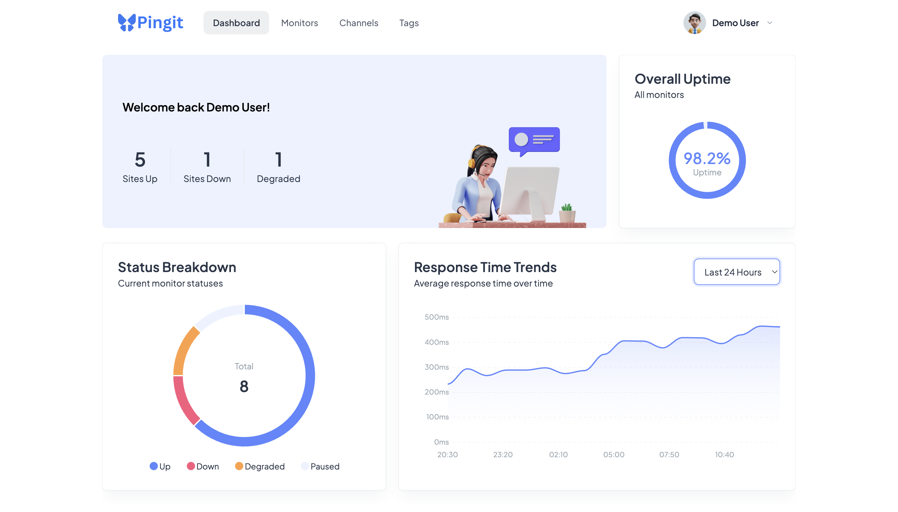
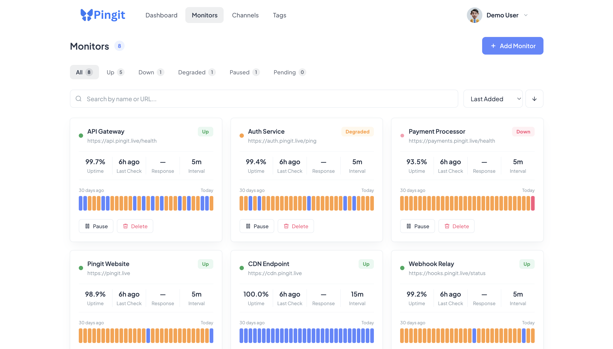
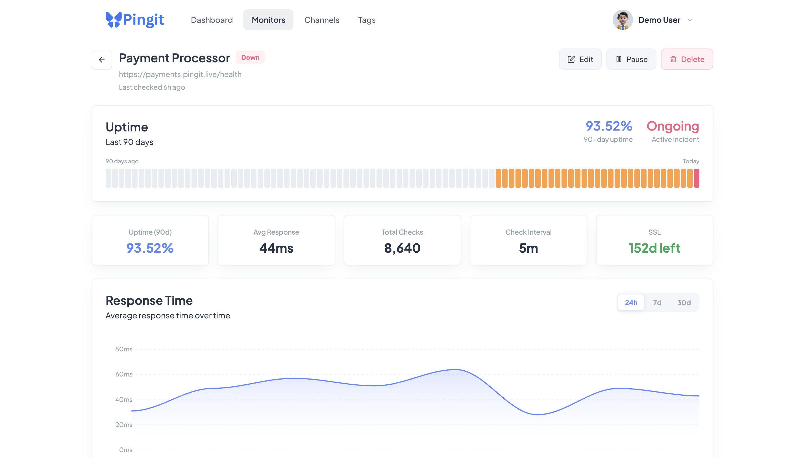

# Pingit App

The frontend application for [Pingit](https://www.pingit.live) — a full-stack uptime monitoring system. Built with Vue 3, Pinia, and ApexCharts.

---

## Live Demo

**Frontend:** [https://www.pingit.live](https://www.pingit.live)

**Backend Repository:** [https://github.com/joecode77/pingit-api](https://github.com/joecode77/pingit-api)

**Demo credentials:**

- Email: `demo@pingit.live`
- Password: `password`

> **Note:** The demo account is pre-loaded with seeded monitors using fictional URLs, so they will appear as `down`. To see the system monitoring real sites, register a new account and add your own URLs.

---

## Table of Contents

- [Screenshots](#screenshots)
- [Features](#features)
- [Tech Stack](#tech-stack)
- [Requirements](#requirements)
- [Installation](#installation)
- [Running the Application](#running-the-application)
- [Building for Production](#building-for-production)
- [Deployment](#deployment)
- [Pages](#pages)

---

## Screenshots

### Dashboard



### Monitors



### Monitor Detail



---

## Features

- **Dashboard** — Overview of all monitors with status breakdown, overall uptime radial chart, and response time trends
- **Monitors List** — Filterable, sortable, searchable list of all monitors with 30-day uptime bars
- **Monitor Detail** — Full detail view with 90-day uptime bar, response time chart, incident timeline, check history table, notification channels, and tags
- **Notification Channels** — Manage email and webhook channels per monitor
- **Tags** — Create and manage tags to organise monitors
- **Authentication** — Register and login with token-based auth
- **Auto-refresh** — Dashboard and monitor detail pages refresh every 30 seconds without a full page reload
- **CSV Export** — Export check history for any monitor
- **Mobile Responsive** — Usable on all screen sizes

---

## Tech Stack

| Layer       | Technology                   |
| ----------- | ---------------------------- |
| Framework   | Vue 3 (Composition API)      |
| State       | Pinia                        |
| Routing     | Vue Router 4                 |
| HTTP Client | Axios                        |
| Charts      | ApexCharts (vue3-apexcharts) |
| Styling     | Tailwind CSS v4 + scoped CSS |
| Font        | Plus Jakarta Sans            |
| Build Tool  | Vite                         |

---

## Requirements

- Node.js 18+
- npm
- A running instance of the [Pingit API](https://github.com/joecode77/pingit-api)

---

## Installation

### 1. Clone the repository

```bash
git clone https://github.com/joecode77/pingit-app.git
cd pingit-app
```

### 2. Install dependencies

```bash
npm install
```

### 3. Copy the environment file

```bash
cp .env.example .env
```

### 4. Configure the API URL

Update your `.env` file with the URL of your running backend:

```env
VITE_API_URL=http://localhost:8000
```

If you are using the live API, set it to:

```env
VITE_API_URL=https://api.pingit.live
```

---

## Running the Application

```bash
npm run dev
```

The app will be available at `http://localhost:5173`.

> **Note:** The [Pingit API](https://github.com/joecode77/pingit-api) must be running for the frontend to work. Follow the setup instructions in the backend repository.

---

## Building for Production

```bash
npm run build
```

The production build will be output to the `dist/` folder.

To preview the production build locally:

```bash
npm run preview
```

---

## Deployment

This app is deployed on [Vercel](https://vercel.com). A `vercel.json` file is included in the repository to handle client-side routing correctly:

```json
{
  "rewrites": [{ "source": "/(.*)", "destination": "/index.html" }]
}
```

### Environment Variables on Vercel

In your Vercel project, go to **Settings → Environment Variables** and add:

| Key            | Value                     |
| -------------- | ------------------------- |
| `VITE_API_URL` | `https://api.pingit.live` |

A redeployment is required after adding environment variables for them to take effect.

---

## Pages

### Login / Register

Authentication screens with form validation and error handling.

### Dashboard

Summary stats across all monitors — total, up, down, degraded, and paused counts, an overall uptime radial chart, and a response time trend area chart aggregated across all active monitors. Auto-refreshes every 30 seconds.

### Monitors

Filterable by status, searchable by name or URL, sortable by name, uptime, or last checked time. Each monitor card shows current status, uptime percentage, last check time, check interval, and a 30-day uptime bar.

### Monitor Detail

Full detail view for a single monitor including:

- 90-day uptime bar
- Key stats (uptime, average response time, total checks, check interval, SSL expiry)
- Response time chart (24h, 7d, 30d)
- Incident history with active incident indicator
- Monitor configuration panel
- Paginated check history table with CSV export
- Notification channels management
- Tags management

Auto-refreshes the monitor status every 30 seconds.

### Notification Channels

Manage email and webhook notification channels across all monitors. Channels are grouped by monitor and show which events they are configured to fire on (down, recovery, degraded).

### Tags

Create and delete tags. Tags are attached and detached from individual monitors on the Monitor Detail page.
